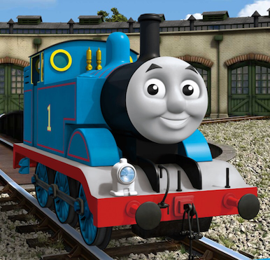

### thomas

##### About
Thomas is a training engine that runs on [coal](https://github.com/boundlessgeo/coal)

Being cute aside, thomas is an object detection and segmentation model that we extend to detect objects in imagery - using Tensorflow, Keras amd Coco.
While we train the models with new data, the majority of the hard work was done [here](https://github.com/matterport/Mask_RCNN). 
The base mrcnn model was copied from that repo and slightly modified to fix a bug or two. The code in the `mrcnn` directory should 
not be touched unless you really know what you are doing. 

Our model code lives in the `objects directory`.

#### Building  

The dev environment for this can be a little trick but _works on my machine_ (osx) as well as on Amazon's deep learning AMI 

To get up and running:

- Setup a python 3.6 virtual env and source it 
- `pip  install -r requirements`
- `export PYTHONPATH=$PATHONPATH:.`
- Get the precomputed model weights from S3, either `s3://tomsorflow/coco/mask_rcnn_coco.h5` or `s3://tomsorflow/buildings/mask_rcnn_buildings_1.h5`

#### Training

#### Analyzing